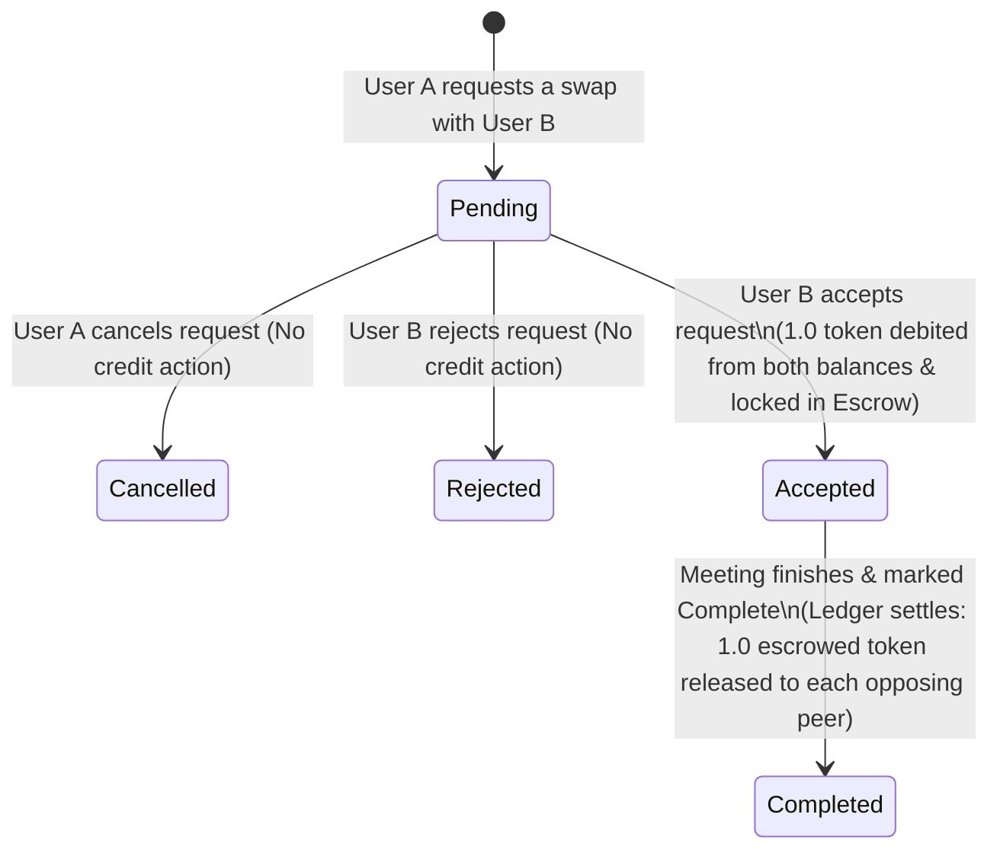

# 📡 Synapse | P2P Skill-Swapping Platform

Synapse is a modern, real-time peer-to-peer (P2P) skill-swapping network that empowers users to connect, trade knowledge, and teach one another. By matching users based on a mutual exchange of skills, Synapse builds a decentralized educational economy. Transactions are secured using a custom **Virtual Skill Credit Ledger**, and lessons are conducted through integrated, dynamic **1:1 Jitsi Meeting Rooms** with real-time Socket.io-driven notifications.

---

## 🚀 Key Features

*   **Mutual Skill-Matching Algorithm:** Automatically connects peers where a mutual teaching/learning interest exists (i.e., User A teaches what User B wants to learn, and User B teaches what User A wants to learn).
*   **Virtual Skill-Credit Wallet & Escrow Ledger:** 
    *   New users start with a baseline balance of **3.0 SKILL_CREDIT** tokens.
    *   Accepting a skill-swap request locks **1.0 token** from both participants into a secure Escrow state.
    *   Marking a session as complete triggers a ledger settlement, releasing the escrowed tokens to the respective peer’s wallet.
*   **Integrated 1:1 Video/Audio Rooms:** Generates dynamic, dedicated Jitsi Meet video rooms upon accepting a swap request.
*   **Real-Time Push Notifications:** Socket.io room-based message dispatching keeps users immediately updated on connection requests, accepts, and cancels.
*   **Secure Multi-Flow Authentication:**
    *   Custom JSON Web Token (JWT) system with short-lived `AccessToken` and secure `RefreshToken` stored in HTTP-only cookies.
    *   Robust session verification with Redis token blacklist validation.
    *   Third-party sign-in support via Google OAuth 2.0 (Passport.js).
*   **ImageKit Avatar Hosting:** Direct multipart image uploads processed via Multer and hosted via ImageKit cloud storage.
*   **Swagger Interactive Documentation:** Full API explorer integrated at `/api/docs`.

---

## 🛠 Tech Stack

### Frontend
*   **Framework:** React 19 (TypeScript) with Vite
*   **Styling:** Tailwind CSS (v4)
*   **State Management:** Redux Toolkit (`@reduxjs/toolkit` and `react-redux`)
*   **Animations:** GSAP (GreenSock Animation Platform) + `@gsap/react`
*   **Routing:** React Router v7
*   **Networking & Socket:** Axios, Socket.io-Client
*   **Toasts:** React Hot Toast

### Backend
*   **Runtime/Framework:** Node.js (Express v5 in TypeScript, executed via `tsx` watch mode)
*   **Database:** MongoDB + Mongoose ORM
*   **Caching & Blacklists:** Redis
*   **Real-time Layer:** Socket.io
*   **Authentication:** Passport.js (Google OAuth 2.0) + JSON Web Tokens (JWT)
*   **Logger:** Winston Logger
*   **File Uploads:** Multer + ImageKit SDK
*   **Validation:** Zod

---

## 📊 Swap Lifecycle & Credit Ledger Workflow

When two users schedule a skill-swap, their wallet balances change according to the request lifecycle:



> [!NOTE]
> Since a completed swap is mutual (both teach and learn), each participant pays 1.0 credit and receives 1.0 credit, resulting in a net-zero token change but a successful knowledge exchange.

---

## 📂 Directory Structure

```text
p2p/
├── backend/
│   ├── src/
│   │   ├── config/            # Server, Socket, Logger, & Env configs
│   │   ├── infrastructure/    # MongoDB (Mongoose) & Redis database clients
│   │   ├── middlewares/       # Auth validators, Multer file uploaders, rate-limiters, & global error handlers
│   │   ├── modules/           # Feature modules (Auth, Connections, Match, Notifications, Profile, Skills, Wallet)
│   │   │   ├── auth/          # Authentication & Google OAuth controllers
│   │   │   ├── connections/   # Connection requests, status, and ledger logic
│   │   │   ├── match/         # Matching logic & peer suggestion controllers
│   │   │   └── ...            # Other system modules (Wallet, Skills, Notifications)
│   │   ├── types/             # Common TypeScript declarations
│   │   ├── utils/             # Helper files (ApiError, ApiResponse, Async handlers)
│   │   ├── app.ts             # Express application mounting
│   │   └── server.ts          # Server entry point
│   ├── tsconfig.json          # TypeScript config
│   └── package.json           # Backend script definitions
│
├── frontend/
│   ├── src/
│   │   ├── app/               # Main Layout, Routes config, CSS styles, & Redux Store
│   │   ├── assets/            # Fonts, SVGs, and visual assets
│   │   ├── features/          # UI features (Auth components, Profile edits, Dashboard pages, Meetings lists)
│   │   │   ├── auth/          # Login, Register, Public & Protected route guards
│   │   │   ├── connections/   # Meetings page UI
│   │   │   ├── shared/        # Hero section Landing Page and Main Dashboard panels
│   │   │   └── ...            # Redux hooks & sub-features
│   │   ├── lib/               # Auth axios interceptor instances & authenticated socket connections
│   │   ├── main.tsx           # React bootstrap element
│   │   └── vite-env.d.ts      # Vite type overrides
│   ├── vite.config.ts         # Vite bundler options
│   └── package.json           # Frontend dependency specs
└── README.md                  # System overview & setup guidelines
```

---

## ⚙️ Getting Started & Setup

### Prerequisites
Make sure you have the following installed:
*   [Node.js](https://nodejs.org/) (v18+)
*   [MongoDB](https://www.mongodb.com/) (Running locally or a MongoDB Atlas URI)
*   [Redis](https://redis.io/) (Running locally or a Cloud Redis instance)
*   An [ImageKit](https://imagekit.io/) Account (for avatar uploading)
*   Google Developer Console OAuth Credentials (optional, for Google Auth)

---

### 1. Configure the Backend

1.  Navigate to the `backend` folder:
    ```bash
    cd backend
    ```
2.  Install dependencies:
    ```bash
    npm install
    ```
3.  Create a `.env` file from the example:
    ```bash
    cp .env.example .env
    ```
4.  Open `.env` and fill in your configurations:
    ```env
    PORT=3000
    NODE_ENV=development
    DB_URL=mongodb://localhost:27017/p2p
    ACCESS_TOKEN_SECRET=your_super_secret_access_jwt_key
    REFRESH_TOKEN_SECRET=your_super_secret_refresh_jwt_key
    REDIS_URL=redis://127.0.0.1:6379
    SALT_VALUE=10
    MEETING_WINDOW_LIMIT=3600
    IMAGEKIT_PRIVATE_KEY=your_imagekit_private_key
    IMAGEKIT_PUBLIC_KEY=your_imagekit_public_key
    GOOGLE_CLIENT_ID=your_google_client_id.apps.googleusercontent.com
    GOOGLE_CLIENT_SECRET=your_google_client_secret
    GOOGLE_CALLBACK_URL=http://localhost:3000/api/auth/google/callback
    CLIENT_URL=http://localhost:5173
    ```
5.  Start the development server:
    ```bash
    npm run dev
    ```

The backend server will spin up at `http://localhost:3000`. You can verify API health checks at `http://localhost:3000/api/healthcheck` and view interactive Swagger documentations at `http://localhost:3000/api/docs`.

---

### 2. Configure the Frontend

1.  Navigate to the `frontend` folder:
    ```bash
    cd ../frontend
    ```
2.  Install dependencies:
    ```bash
    npm install
    ```
3.  Create a `.env` file from the example:
    ```bash
    cp .env.example .env
    ```
4.  Configure the backend server URL in your `.env`:
    ```env
    VITE_BACKEND_URL=http://localhost:3000
    ```
5.  Launch the React dev server:
    ```bash
    npm run dev
    ```

Open your browser and navigate to `http://localhost:5173`.

---

## 📡 API Endpoint Reference

| Method | Endpoint | Description | Auth Required |
| :--- | :--- | :--- | :--- |
| **POST** | `/api/auth/register` | Register a new user | No |
| **POST** | `/api/auth/login` | Login user & set cookie tokens | No |
| **POST** | `/api/auth/logout` | Revoke tokens & clear cookies | Yes |
| **POST** | `/api/auth/refresh-token` | Regenerate access token | No |
| **GET** | `/api/auth/google` | Trigger Google OAuth 2.0 | No |
| **GET** | `/api/skills/me` | Fetch user's skills profile | Yes |
| **PUT** | `/api/skills/update` | Update skills to teach & learn | Yes |
| **GET** | `/api/match/dashboard` | Get mutual skill matching peers | Yes |
| **POST** | `/api/connection/request` | Submit a skill-swap meeting request | Yes |
| **POST** | `/api/connection/respond` | Accept or reject connection request | Yes |
| **POST** | `/api/connection/complete` | Complete session & settle credits | Yes |
| **POST** | `/api/connection/cancel` | Cancel a pending swap request | Yes |
| **GET** | `/api/connection/me` | Get current user's meetings list | Yes |
| **GET** | `/api/wallet/me` | Fetch user's wallet credit balance | Yes |
| **POST** | `/api/profile/upload` | Upload new user avatar (ImageKit) | Yes |
| **GET** | `/api/notification` | Fetch unread push alerts | Yes |
| **POST** | `/api/notification/mark-read-all`| Mark all push notifications as read | Yes |

---

## 🛡 Security & Best Practices
*   **HttpOnly Cookies:** Session tokens are stored as HttpOnly, SameSite cookies to protect them from XSS attacks.
*   **Redis Blacklisting:** Invalidation of Refresh Tokens on logout prevents replay hijack attacks.
*   **Database Transactions:** Ledger updates (debiting balances, locking escrow, completing swaps) are run within strict MongoDB Transactions to guarantee consistency across wallets.
*   **Schema Enforcement:** Request bodies are strictly parsed and sanitized using Zod schemas before hitting business controllers.
